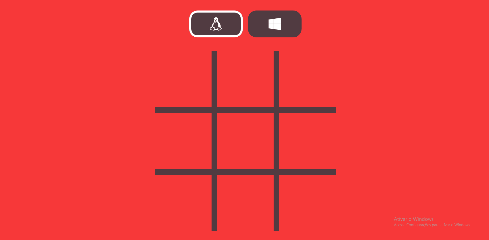

# Projeto Jogo da Velha 🪙 ✔️ 

- 💻 Olá pessoal, Este é um projeto desenvolvido para funcionar como um jogo da velha. Neste adicionei algumas funcionalidades como: Mensagem interativa para o vencedor, ou quando a partida terminar em empate; placar interativo mostrando a vez de cada "player" jogar e botão reiniciar utilizando o objeto window reload().

  

## O projeto: 

<h1 align="center">
    
</h1>

 

## 🛠 &nbsp;Tecnologias utilizadas:

&nbsp;
&nbsp;
&nbsp;
&nbsp;

  

## 👨🏽‍🦲 &nbsp;Autor do projeto: Vinícius Luz; Meu linkedin:

